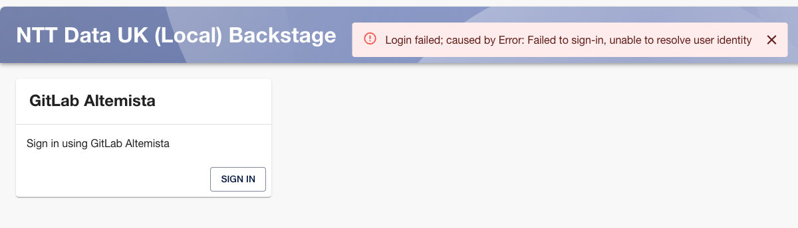
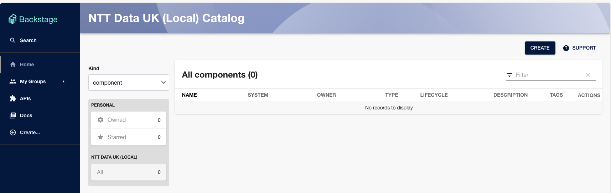
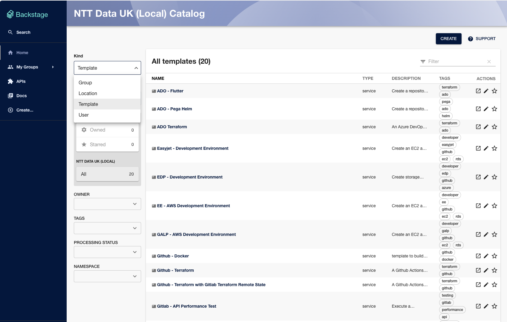

# NTT Data Local Backstage

This is a backstage app ready configured to use git.altemista.cloud as both an auth and catalogue source.

[[_TOC_]]

Configuration differences from a 'clean' backstage are:

backend packages have been added:

* gitlab auth package to backend
* gitlab catalog package to backend
* others...

see [backstage modifications](docs/modifications.md) for details.


## Installing


### Configuring your account on Altemista to allow backstage to authenticate
You'll need a personal access token, and a gitlab app for backstage to use.

A walkthrough of setting these up is in

[Altemista config](docs/altemista-config.md)

### Instructions - Mac OSX
On MacOS, you will want to have run xcode-select --install to get the XCode command line build tooling in place.

Using nvm (recommended)
#### Install nvm
using homebrew
```bash
brew install nvm
nvm install 20
npm install -g yarn
```

With the tools installed, you'll need to create:
* A personal access token for gitlab altemista
* A gitlab oath app for gitlab altemista
* (optionally) a github personal access token


#### Starting backstage

##### environment variables
In order for the gitlab (and github) integrations to work, the following environment variables need to be set.

(Since some of these are credentials, I recommend `envchain` (brew install envchain) for mac users for anything below marked **sensitive**

* `AUTH_GITLAB_ALTEMISTA_CLIENT_ID` - the id of your gitlab oath app used to authenticate users
* `AUTH_GITLAB_ALTEMISTA_CLIENT_SECRET` - **sensitive** the secret of your gitlab oath app used to authenticate users
* `GITLAB_ALTEMISTA_TOKEN` - **sensitive** the gitlab personal access token used to integrate with gitlab altemista for the catalog
* `GITHUB_TOKEN` - **sensitive** the github personal access token used to integrate with github

The simplest way to run is in local dev mode - the backend and frontend app will start, and your local browser will open pointing to localhost:3000

```bash
yarn dev
```
The first time you run, it will take a moment for backstage to sync the altemista github users & groups, so if you try to log in instantly, it will likely fail to find your username.



As soon as you see the following 2 log entries, you'll be good to go.
(next time you start the users & groups are already present, so you'll be able to log in instantly)

* `catalog info Scanned 1807 users and processed 1807 users target=GitlabOrgDiscoveryEntityProvider:altemista`
* `catalog info Scanned 378 groups and processed 22 groups target=GitlabOrgDiscoveryEntityProvider:altemista`

Once you've logged in, you should see what looks like an empty system.



Select 'Template' from the Kind menu dropdown, and you should see that there are templates imported.



