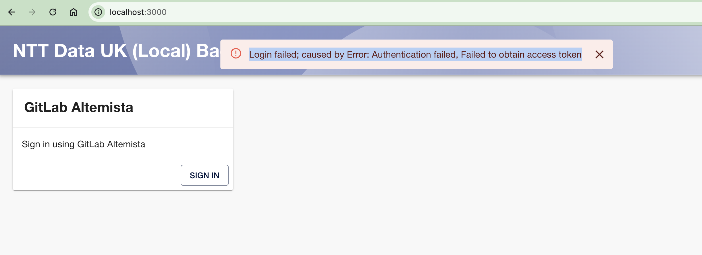

# NTT Data Local Backstage

This is a backstage app ready configured to use git.altemista.cloud as both an auth and catalogue source.

[[_TOC_]]

Configuration differences from a 'clean' backstage are:

backend packages have been added:

* gitlab auth package to backend
* gitlab catalog package to backend
* others...

see [backstage modifications](docs/modifications.md) for details.


## Installing


### Configuring your account on Altemista to allow backstage to authenticate
You'll need a personal access token, and a gitlab app for backstage to use.

A walkthrough of setting these up is in

[Altemista config](docs/altemista-config.md)

### Instructions - Mac OSX
On MacOS, you will want to have run xcode-select --install to get the XCode command line build tooling in place.

#### Nodejs & yarn setup
Using nvm (recommended)
##### Install nvm
using homebrew
```bash
brew install nvm
nvm install 20
npm install -g yarn
```
If this is the first time you've used nvm, make sure you follow the instructions brew provides on integrating with your profile

If you've previously installed node/yarn directly with homebrew, then it may be necessary to uninstall them
(if you see errors with `/bin/sh: concurrently: command not found` then check that `which yarn` and `which node` give the same path)

#### Starting backstage

##### environment variables
In order for the gitlab (and github) integrations to work, the following environment variables need to be set.

Since some of these are credentials, I recommend [direnv for variables and envchain](docs/using-direnv-and-envchain.md) for anything below marked **sensitive**

* `AUTH_GITLAB_ALTEMISTA_CLIENT_ID` - the id of your gitlab oath app used to authenticate users
* `AUTH_GITLAB_ALTEMISTA_CLIENT_SECRET` - **sensitive** the secret of your gitlab oath app used to authenticate users
* `GITLAB_ALTEMISTA_TOKEN` - **sensitive** the gitlab personal access token used to integrate with gitlab altemista for the catalog
* `GITHUB_TOKEN` - **sensitive** the github personal access token used to integrate with github
* `NODE_OPTIONS=--no-node-snapshot` # only needed for node v20 or above
The simplest way to run is in local dev mode - the backend and frontend app will start, and your local browser will open pointing to localhost:3000

```bash
yarn dev
```

The first time you run backstage, it will take a moment for backstage to sync the altemista github users & groups, so if you try to log in instantly, it will likely fail to find your username.


As soon as you see the following 2 log entries, you'll be good to go.
(next time you start the users & groups are already present, so you'll be able to log in instantly)

* `catalog info Scanned 1807 users and processed 1807 users target=GitlabOrgDiscoveryEntityProvider:altemista`
* `catalog info Scanned 378 groups and processed 22 groups target=GitlabOrgDiscoveryEntityProvider:altemista`

**NB**
If you see the error below when logging in, and`FetchError` messages in the console logs related to being unable to get local issuer certificate
then also set the following environment variable to disable strict tls checking for node.
* `NODE_TLS_REJECT_UNAUTHORIZED=0`


Once you've logged in, you should see what looks like an empty system.


Select 'Template' from the Kind menu dropdown, and you should see that there are templates imported.


