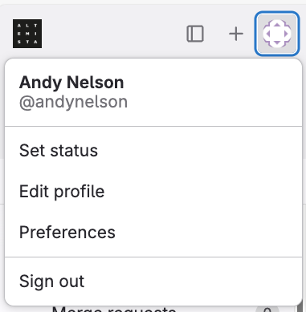
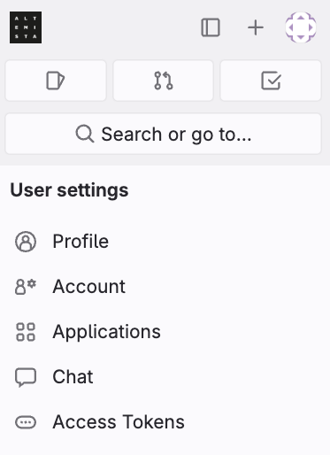
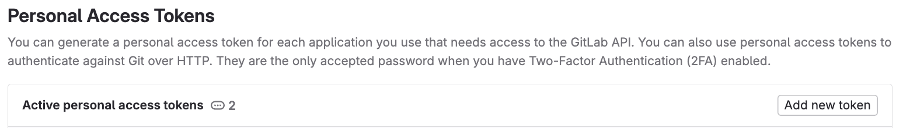
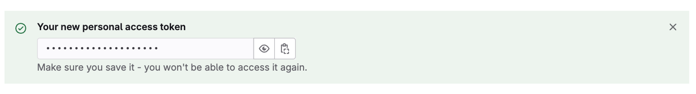
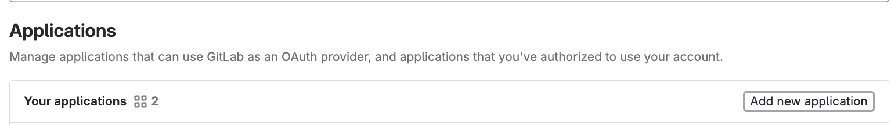
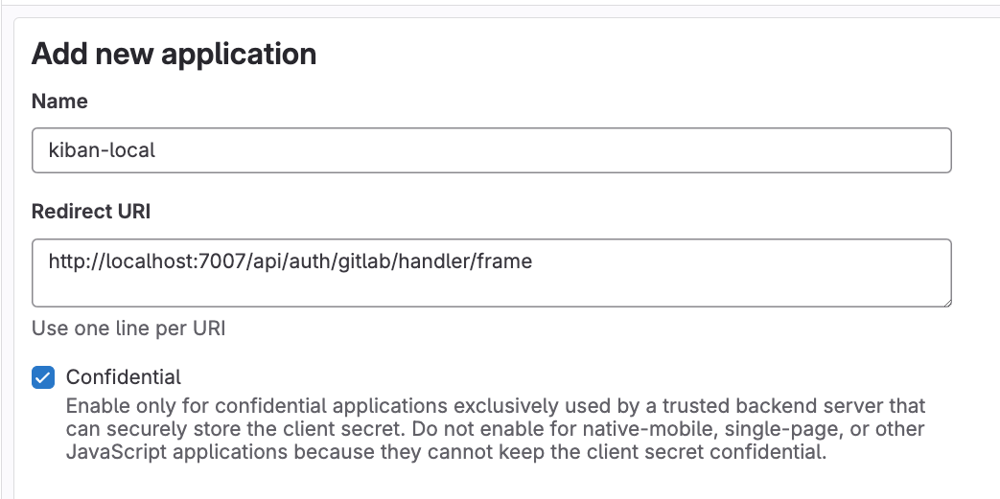
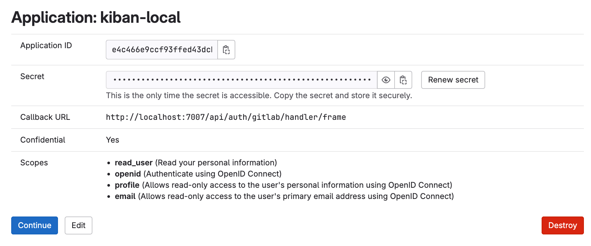

[back](./README.md)

---

# Configuring Altemista access for local use

In order for backspace to access altemista, you need two sets of credentials:
## A Personal Access token (used before login, to sync users/groups, and to load the catalog from repos)

To create the access token, click on your profile pic in the top left of the browser window, and choose 'Preferences',

|||

then choose 'Access Tokens' from the sidebar, and click the 'Add Access Token' button.

The scopes this token needs are:
* read_api
* read_user
* read_repository

Once you hit the 'Create personal access token' button, you'll be able to view/copy the access token until you navigate away
(there is no way to get the access token again after this... so if you forget to save it anywhere you'll need to create a new one!)

This token needs to be set in the environment you'll be running backstage in as `GITLAB_ALTEMISTA_TOKEN`
(and it is a credential, so consider using envchain or similar)

## A GitLab App (used to provide oauth login)

To create the App, navigate to 'Preferences' again, and choose 'Applications' from the sidebar.

|||

click the 'Add new application' button to create a new personal application

You'll need to provide the callback url for the app - use `http://localhost:7007/api/auth/gitlab/handler/frame`

The application needs to be `Confidential`  with the following scopes:
* read_user
* openid
* profile
* email

once you click the `complete` button, you'll see a screen that allows you to copy the `Application ID` and `Secret`.

(This is your only chance to see the secret, but new secrets can be assigned to an application - the application id is always available to copy again)

These need to be set in the environment backstage runs in as `AUTH_GITLAB_ALTEMISTA_CLIENT_ID` and `AUTH_GITLAB_ALTEMISTA_CLIENT_SECRET`
(`AUTH_GITLAB_ALTEMISTA_CLIENT_SECRET` is essentially a password, so treat accordingly)

With both the access token, and the app configured, you should now have 3 environment variables:
* `GITLAB_ALTEMISTA_TOKEN` (set to the value of your personal access token)
* `AUTH_GITLAB_ALTEMISTA_CLIENT_ID` (set to the value of your application's id)
* `AUTH_GITLAB_ALTEMISTA_CLIENT_SECRET` (set to the value of your applications' secret)

---
[back](./README.md)
