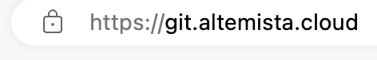
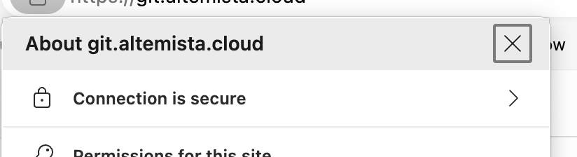
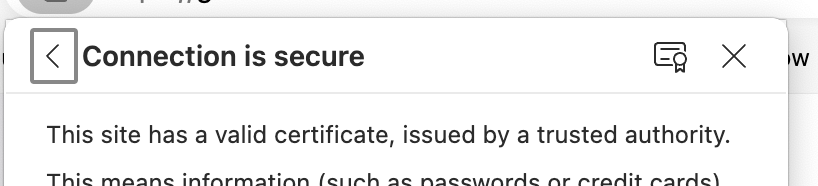
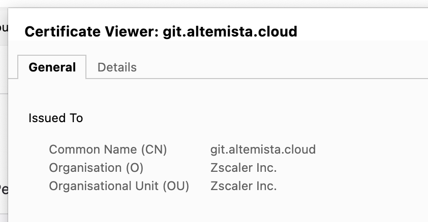
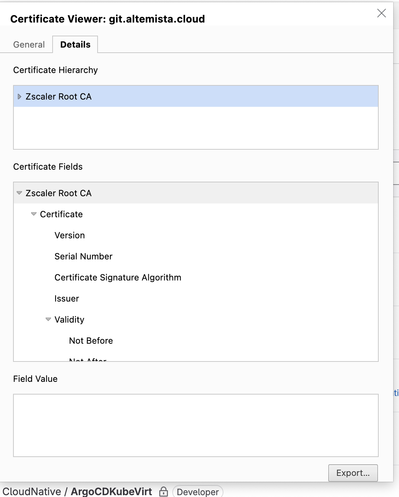
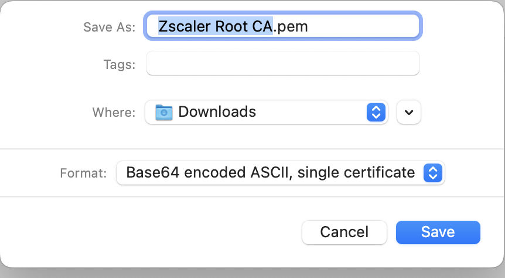

[back](./README.md)

---

# Downloading zscaler (or other) root certificates using a browser

In order to avoid errors caused by backstage not being able to validate ssl certificates when proxying requests to backends, it will need to trust the zscalar root certificate.

You can download this using a chrome based browser (including ms edge) by:

1) Browsing to a website, then clicking the padlock icon at the left of the address bar

2) This will bring up a dialog - expand the 'Connection is secure' item

3) Then click on the certificate icon at the top

4) This will bring up a certificate dialog

5) Switch to the 'details' tab, and click the 'export' button

6) The file type you want is 'Base 64 encoded ASCII, single certificate'

---
[back](./README.md)
